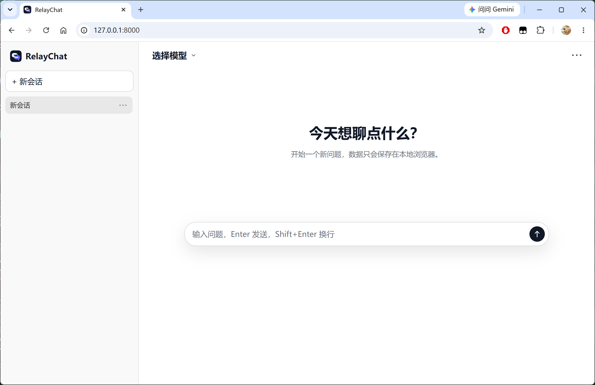

# RelayChat

部署在可访问 AI API 的服务器上的轻量问答网站。后端使用 Python/FastAPI 提供静态页面、AI API 转发、账号登录和历史同步，前端为静态页面。



## 功能

- 未登录时在浏览器本地保存设置、Token、模型列表和多会话历史
- 登录后可通过账号同步 API URL/Token 配置、当前模型、协议、模型列表和对话记录
- API URL/Token 支持保存多组，URL 作为唯一键；输入框右侧可展开历史 URL，选择后自动带出对应 Token
- 模型支持输入模型列表外的名称，失焦后保存到当前模型列表；再次获取模型成功时用接口结果覆盖列表
- 支持注册、登录、注销；同一账号可多端登录
- 多会话聊天，提问时自动携带上下文
- 支持模型列表获取：`/v1/models`
- 支持三种协议：
  - `Anthropic` -> `/v1/messages`
  - `OpenAI Chat` -> `/v1/chat/completions`
  - `OpenAI Responses` -> `/v1/responses`
- 切换模型时自动推断协议：
  - 模型名包含 `claude` -> Anthropic
  - 其他模型 -> OpenAI Chat
- 支持流式显示和前端逐字输出效果
- 用户向上查看历史时暂停自动滚动，离底部较远时显示回到底部按钮
- 支持 thinking/reasoning 展示
- 支持外观设置：自动、浅色、深色；自动模式跟随浏览器或系统主题
- 支持轻量 Markdown 渲染：标题、列表、引用、分隔线、链接、行内代码、围栏代码块
- 代码块支持右上角复制按钮
- 生成中可点击停止按钮打断；生成中不能发送新消息
- 类 ChatGPT 界面：左侧会话列表、顶部模型选择、右上角设置菜单

## 数据保存

- 未登录：数据只保存在当前浏览器 `localStorage`，包含当前 API 配置、已保存的多组 URL/Token、模型列表和会话历史。
- 登录后：账号数据保存在服务器 SQLite 数据库 `data/relay-chat.sqlite3`，包含当前 API 配置、已保存的多组 URL/Token、模型列表和会话历史。
- 新用户首次登录后，如果浏览器里已有本地数据，会询问是否上传到账号；上传成功后再询问是否删除本地数据。
- 登录 token 默认 7 天滑动有效期；过期后需要重新登录。

## 访问认证

- 配置 `ACCESS_CODE` 后，未登录首次进入页面需要输入访问码；访问码会明文保存在当前浏览器 `localStorage`。
- 未登录调用 `/api/chat`、`/api/models` 时会带 `X-Access-Code`，后端每次校验访问码。
- 登录后调用 `/api/chat`、`/api/models` 使用登录 token，不需要访问码。
- 配置 `REGISTRATION_CODE` 后，注册账号必须输入注册码。
- 未配置 `ACCESS_CODE` 或 `REGISTRATION_CODE` 时，对应能力按开发开放模式处理。

## 启动

```bash
pip install -r requirements.txt
python3 -m uvicorn server.main:app --host 0.0.0.0 --port 8000
```

访问：

```text
http://服务器IP:8000
```

## 注意

- 用户填写的 API URL 不带 `/v1`，后端会自动拼接 `/v1/...`。
- 点击“保存”或“获取模型”成功时，会保存当前 URL/Token；切换历史 URL 会自动填入对应 Token，可在同一行点击“删除 URL”移除当前 URL。
- 转发请求默认带：`X-Origin-Agent: stepcode`。
- Anthropic 鉴权也使用：`Authorization: Bearer <token>`。
- 未登录时 API Token 保存在浏览器 `localStorage`；登录后 API Token 会保存到服务器数据库。
- 生产公网部署建议配合 HTTPS，并配置访问码和注册码。
- 安全增强计划见 `docs/TODO.md`。

## systemd 安装

安装并启动服务：

```bash
sudo ./scripts/install.sh
```

默认配置：

```text
服务名: relay-chat
监听: 0.0.0.0:8000
运行用户: 当前用户；sudo 执行时为 sudo 调用用户
```

参数形式覆盖默认值：

```bash
sudo ./scripts/install.sh --service-name relay-chat --host 127.0.0.1 --port 8000 --user zzc
```

如果使用 Nginx/Caddy 做 HTTPS 反代，推荐只监听本机：

```bash
sudo ./scripts/install.sh --host 127.0.0.1 --port 8000
```

查看状态：

```bash
systemctl status relay-chat.service
```

查看日志：

```bash
journalctl -u relay-chat.service -f
```

修改后端代码后重新部署当前服务：

```bash
sudo systemctl restart relay-chat.service
```

只修改 `static/` 下的前端静态文件时，刷新浏览器即可生效。

卸载 systemd 服务：

```bash
sudo ./scripts/uninstall.sh
```

卸载自定义服务名：

```bash
sudo ./scripts/uninstall.sh --service-name relay-chat
```
